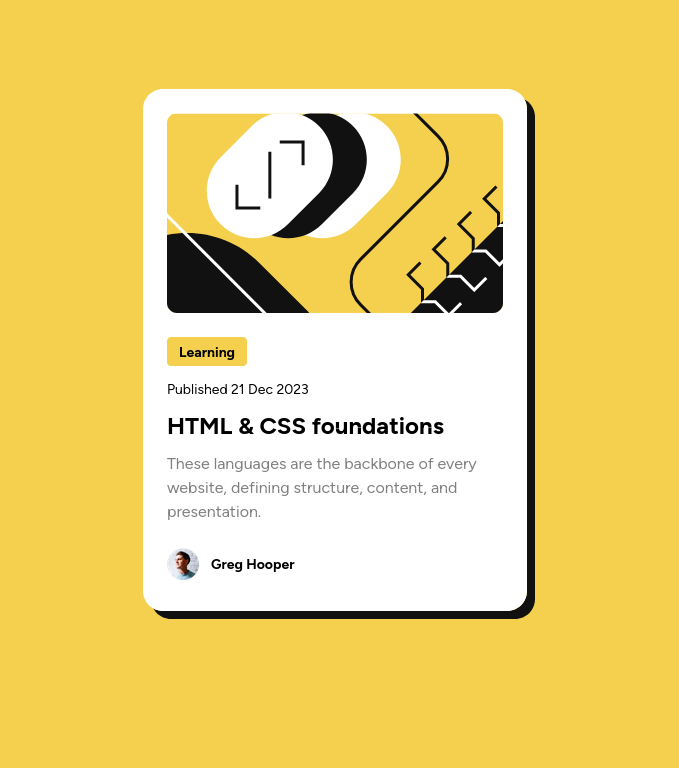

# Frontend Mentor - Blog preview card solution

This is a solution to the [Blog preview card challenge on Frontend Mentor](https://www.frontendmentor.io/challenges/blog-preview-card-ckPaj01IcS). Frontend Mentor challenges help you improve your coding skills by building realistic projects.

## Table of contents

- [Overview](#overview)
  - [The challenge](#the-challenge)
  - [Screenshot](#screenshot)
  - [Links](#links)
- [My process](#my-process)
  - [Built with](#built-with)
  - [What I learned](#what-i-learned)
  - [Continued development](#continued-development)
- [Author](#author)

## Overview

### The challenge

Users should be able to:

- See hover and focus states for all interactive elements on the page

### Screenshot



### Links

- [Solution URL](https://github.com/ffrosch/frontendmentor-blog-preview-card)
- [Live Site URL](https://ffrosch.github.io/frontendmentor-blog-preview-card/)

## Tech Stack

This exercise uses `react-ts`, `emotion` and a custom deployment workflow on Github Pages.

### Installation

```shell
# install in current directory
npm create vite@latest . -- --template react-ts
npm install --save @emotion/react
npm install -D @emotion/babel-plugin
```

### Configuration

To suppport the `css` prop from `emotion` (with Typescript) a few adjustments are necessary (thanks go out to [Mehdi Najafi
Mehdi Najafi](https://dev.to/mehdinajafi/how-to-use-emotion-css-prop-in-vite-39pj)):

`vite.config.js`

```js
import { defineConfig } from 'vite';
import react from '@vitejs/plugin-react';

export default defineConfig({
  plugins: [
    react({
      jsxImportSource: '@emotion/react',
      babel: {
        plugins: ['@emotion/babel-plugin'],
      },
    }),
  ],
});
```

`tsconfig.json`

```json
{
  "compilerOptions": {
    // ...
    "jsxImportSource": "@emotion/react"
  }
}
```

`vite-env.d.ts`

```ts
/// <reference types="vite/client" />
/// <reference types="@emotion/react/types/css-prop" />
```

## My process

### Built with

- Semantic HTML5 markup
- CSS custom properties
- Flexbox
- CSS Grid
- Typescript
- [React](https://reactjs.org/)
- [Vite](https://vitejs.dev/)
- [Emotion CSS](https://emotion.sh/)

### What I learned

I practiced using **Emotion CSS**, a CSS-in-JS library.
The approach I chose was to mainly work with object styles.
Additionally I used the css prop, which necessitated some adjustments for Typescript, and the global css component.
My previous experience with **styled-components** was very helpful.
Getting some more practice with Typescript was also nice.

The thing I am most proud of is using CSS custom properties combined with CSS-in-JS, which led to very clean code for adjusting css properties for different screen sizes.

### Continued development

CSS inheritance with CSS-in-JS combined with the power of CSS custom properties!

### Useful resources

- [CSS variables for react-devs](https://www.joshwcomeau.com/css/css-variables-for-react-devs/)
- [Emotion CSS best practices](https://emotion.sh/docs/best-practices)
- [Colocation](https://kentcdodds.com/blog/colocation)
- [Change how you write your CSS-in-JS for better performance](https://douges.dev/blog/taming-the-beast-that-is-css-in-js)

## Author

- Website - [florianfrosch.de](https://florianfrosch.de/)
- Frontend Mentor - [@ffrosch](https://www.frontendmentor.io/profile/ffrosch)
